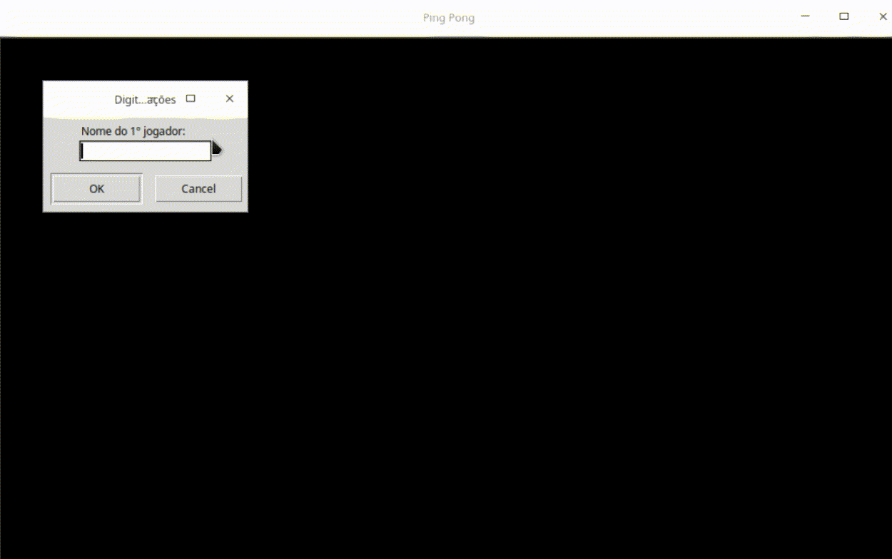

# Python Pong
**Version 1.0.0**

Pong game made with Python Turtle.

<p align="center">
  
</p>

## Table of Contents
* [Getting Started](#getting-started)
* [Installing](#installing)
* [Built With](#built-with)
* [Author](#author)
* [License](#license)

## Getting Started
These instructions will get you a copy of the project up and running on your local machine for development and testing purposes.

## Installing
Run the following commands and you will end up with a local running version of the project.
```
$ git clone https://github.com/jonathasgouv/pythonpong.git
$ cd pythonpong/
$ python pong.py
```
And that's it, the game is running. 

Note that in order to it work properly you must have Python and the modules Pygame and Turtle installed on your computer or virtual enviroment. And because Turtle uses tkinter for the underlying graphics, it needs a version of Python installed with Tk support.

## Built With
* [Python 3](https://www.python.org/downloads/)
* [Turtle](https://docs.python.org/3/library/turtle.html)

## Author
* [Jônathas Gouveia](https://github.com/jonathasgouv/)

## License
This project is licensed under the  GPL-3.0 License - see the [LICENSE](https://github.com/jonathasgouv/pythonpong/blob/master/LICENSE) file for details
